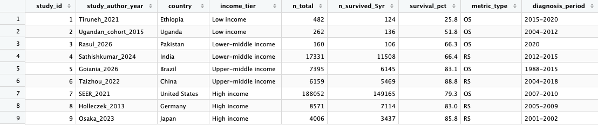
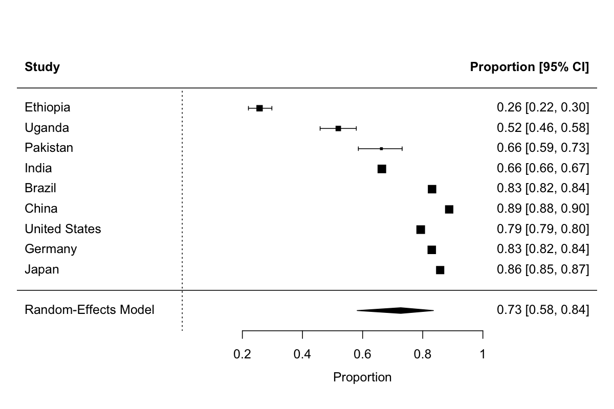
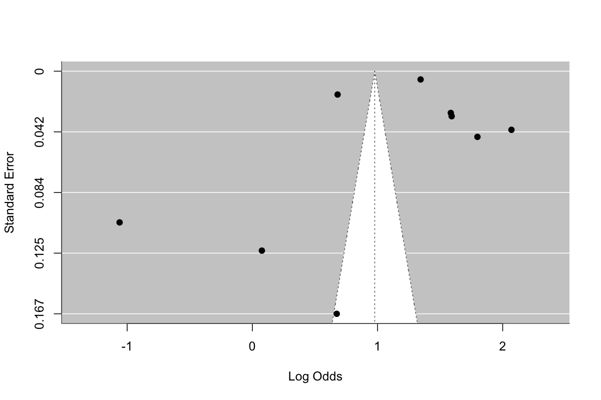

# Global Breast Cancer Survival Meta-Analysis

## Motivation

This is a personal project I built to develop my skills in biostatistics and meta-analysis as I prepare to apply to MS programs in the field. I'm a firm believer in learning by doing, and this project felt like a good way to do two things at once: apply real technical skills, and present the results in a way that is understandable to everyone, not just people already fluent in statistics.

Breast cancer is a disease that is incredibly widespread, and it has personally affected people close to me, so this isn't just an academic exercise to me. I also wanted to find a way to combine my Global Health Certificate background with a genuinely rigorous statistical analysis, and the question of survival disparities across countries felt like a natural fit.

A WHO study published in Nature Medicine in July 2026 estimated global 5-year breast cancer survival for the first time across all 194 WHO member states, finding survival ranging from a median of 41.9% in low-income countries to 87.3% in high-income countries. That paper was part of the inspiration for this project, though I took a different approach: rather than using WHO's own aggregated country-level estimates, I independently searched for, extracted, and statistically synthesized data from individually published cohort and population-registry studies.

My goal throughout was to answer this question as biologically and mathematically accurately as I could, given my current level of knowledge, while being upfront about the limitations along the way. Research is sometimes too technical, to the point where the people it's meant to inform have a hard time understanding or applying it. A goal I have for myself, in this project and beyond, is to be a translator of jargon in this field, someone who can make real statistical work understandable to people without a statistics background.

## Data

Finding usable data turned out to be the hardest part of this whole project. There were several instances where a study I found reported a survival percentage but not a verifiable sample size, or reported data for a subtype rather than breast cancer overall, and I did not want to include a number I could not fully defend just to fill a slot in the dataset. Algeria was one example of this, as through my coursework, this country has come up time and time again as a low-income country. I initially planned to include it as a lower-income comparison country, but I could not track down a verifiable sample size for the estimate I found, so I ended up replacing it with a different country's study instead. This also points to a disparity in the research itself: reliable data was much harder to find for lower-income countries than for wealthier ones, which is something I hope changes in the future. I learned that in research, when the data you want does not exist or cannot be verified, you have to be flexible and adjust your approach rather than force a study that does not hold up. That is part of why the final list of 9 studies looks the way it does, and why every number in it is one I can trace back to a specific, real, citable source.



### Inclusion criteria

I included a study if it met all of the following:
1. Reported a 5-year overall survival or 5-year relative survival estimate for breast cancer patients
2. Reported the total sample size, since I needed this to weight each study properly
3. Was an actual population-based or hospital-based cohort study, not a modeled estimate like GLOBOCAN
4. Had a clearly identifiable country, so I could assign an income classification to it

Full citations for each study are listed at the bottom of this README.

### Income classification

I classified countries using the World Bank's FY2026 income groups (Low income, Lower-middle income, Upper-middle income, High income), instead of trying to figure out each country's historical income level at the time its specific data was collected. My studies span diagnosis periods from 1988 to 2020, so matching each one to a historically accurate income tier would have added more uncertainty than it solved. Income tier here describes each country's current economic context, not its income level at every point during data collection.

One exception: Ethiopia is currently "unclassified" by the World Bank for FY2026 due to a lack of reliable economic data, not because it moved up a tier. Based on its estimated GNI per capita (~$1,120, below the $1,175 low-income threshold), I classified it as Low income.

### A note on metric type (OS vs. RS)

My 9 studies use two different survival metrics: overall survival (OS), the raw proportion of patients alive at 5 years, and relative survival (RS), which adjusts for background (non-cancer) mortality using national life tables. These aren't directly equivalent. I noticed my OS studies tend to be hospital cohorts from lower-income countries, which don't have the linked vital registries needed to calculate RS, while my RS studies tend to come from population registries in wealthier countries. I test this directly as a potential confound in the Methods and Results sections below.

## Methods

All analysis was done in R using the `metafor` package.

### Effect size calculation

I only had access to published proportions, not raw patient-level data, so I derived the number of 5-year survivors for each study by multiplying its reported survival percentage by its total sample size and rounding to the nearest whole person. This let me feed `metafor` something closer to real counts instead of just percentages, which matters because raw percentages don't average correctly, especially near 0% or 100%. I used `escalc()` to convert each study's survival proportion into a logit-transformed effect size (`measure = "PLO"`) along with its variance, specifically because the logit transformation is built to handle that extreme-value problem, which regular percentages can't do on their own.

### Pooling model

I chose a random-effects model (`rma()`) instead of a fixed-effects model because a fixed-effects model assumes every study is secretly estimating the same single true value, and any differences between studies are just noise. That did not make sense for my data, since I already expected genuinely different countries to have genuinely different true survival rates, not just noisy estimates of one shared number. Each study is weighted by the inverse of its variance, so larger, more precise studies (like the U.S. SEER data, n = 188,052) count more toward the pooled estimate than smaller studies (like the Pakistan cohort, n = 160), which is the correct way to combine studies of very different sizes and reliability. The model also estimates tau², which captures how much real variation exists between countries beyond what sampling error alone would explain.

### Meta-regression

I added income tier as a moderator (`mods = ~ income_tier`) because a pooled estimate on its own does not tell you why studies differ, only that they do. Turning this into a meta-regression let me actually test and quantify whether income tier explains the differences in survival across countries, rather than just assuming it does because the idea made intuitive sense.

I then ran a second model adding `metric_type` (OS vs. RS) alongside income tier. I made this decision because I noticed earlier in this project that my OS studies and RS studies were not evenly spread across income tiers: my lower-income studies (Ethiopia, Uganda, Pakistan, Brazil) were mostly reporting OS, while several of my higher-income studies (India, China, Germany, Japan) were reporting RS instead. This bothered me, because OS and RS are not measuring quite the same thing. RS adjusts for the chance that a patient dies of something unrelated to their cancer, using national life tables, while OS just counts everyone who died of any cause. This means RS numbers are usually a little higher than OS numbers would be for the same group of patients, all else being equal. If lower-income countries were disproportionately stuck reporting OS, and higher-income countries were disproportionately reporting RS, then part of what looked like a real income-driven survival gap could actually just be an artifact of which metric each country's data happened to use, not a true difference in patient outcomes. I did not want to report an income effect without ruling this out first, so I added `metric_type` directly into the model to test it, rather than just flagging it as a limitation without checking whether it actually mattered.

### Visualization

I used a forest plot because it is the clearest way to show both each study's individual result and how they combine into one overall picture at the same time. I also generated a funnel plot to check for asymmetry that could suggest publication bias, though I kept in mind that this check has limited power with only 9 studies, so I did not want to overstate what it could tell me.

## Results

When I pooled all 9 studies together, the overall 5-year breast cancer survival estimate came out to 72.7%, with a 95% confidence interval of 58.2% to 83.6%. At first glance that number seems like a reasonable summary, but I don't think it actually tells you much on its own, and here's why. The confidence interval tells you how uncertain the average itself is, but it doesn't tell you how spread out the individual countries actually are. For that you need the prediction interval, which estimates where a new country's true survival rate would probably fall, and that range came out to 25.6% to 95.4%. That's an enormous spread. It basically means if you picked a random country not in my dataset, its real survival rate could plausibly be anywhere from a quarter of patients surviving to almost all of them. So the 72.7% average isn't really describing any single country well, it's just the midpoint of a huge range. This matched what I already suspected going in: the heterogeneity across these 9 studies was extremely high, with I² coming out to 99.94% (Q(8) = 2838.48, p < .0001). Almost none of the differences between these countries are due to random chance. Something structural is driving them, and that's what I wanted to actually test next.

That's where income tier came in. When I added income tier as a moderator, it explained 83.75% of the heterogeneity I'd just found (QM(3) = 42.21, p < .0001), which honestly surprised me a little, since that's a large amount of variation to be explained by a single variable. Compared to high income countries, which R automatically set as the reference group, low income countries had significantly lower survival (estimate of -2.07 on the logit scale, p < .0001), and lower-middle income countries also had significantly lower survival, though the gap was smaller (-0.90, p = 0.0162). Upper-middle income countries were not significantly different from high income countries in this dataset (+0.26, p = 0.48). Even with income tier in the model, there was still some heterogeneity left over that it didn't explain (QE(5) = 300.30, p < .0001), so income tier is clearly a major piece of this puzzle, but not the whole picture.

Since I'd noticed earlier that my OS studies and RS studies weren't evenly spread across income tiers, I wanted to make sure that wasn't secretly driving the income effect instead of income tier itself. So I added `metric_type` into the model alongside income tier, and it came back not significant (p = 0.36). The income tier coefficients also barely moved once `metric_type` was added in, the low income estimate only shifted from -2.07 to -1.88. That was a genuinely reassuring result. It means the income effect I found seems to be real and fairly robust, not just an artifact of which survival metric happened to get used in which country.

Below is the forest plot, showing each study's individual estimate and confidence interval next to the pooled result. The studies are ordered by income tier, and you can actually see the gradient just by looking at where each point falls left to right.



And here's the funnel plot, which is meant to check for publication bias:



This one does look somewhat asymmetric, but I don't think that's strong evidence of actual publication bias here. A funnel plot's logic assumes most of the scatter you're seeing is random noise, but I already know from the I² value that almost none of my heterogeneity is random, it's mostly real and already explained by income tier. So this plot is probably just reflecting that same disparity again rather than telling me something new about missing studies. I also only have 9 studies total, well under the 10 or more that's usually recommended before trusting this kind of check, so I'm not reading too much into it either way.

## Limitations

There are a few real limitations to this project that I want to be upfront about rather than gloss over, since the point of doing this was to become a better scientist and, hopefully, a prospective biostatistician, not just to produce a clean-looking result.

The biggest one is probably just the sample size of studies themselves. Nine studies is enough to run a meta-analysis and see a real pattern, but it's still a small number, especially when I'm trying to represent four entire income tiers with only two or three studies each. A single hospital cohort from Uganda or a single registry from Brazil is not the same thing as "Uganda" or "Brazil" as a whole, and I don't want to overstate what one study from one city or one hospital can tell you about an entire country's healthcare system.

The studies are also pretty different from each other in ways beyond just income tier. Some are large national population registries, like SEER in the US or the Saarland registry in Germany, and others are single hospital cohorts, like the ones I used for Uganda and Pakistan. Population registries capture a broader, more representative slice of a country's patients, while hospital cohorts can be biased toward whoever happened to show up at that specific hospital. I tried to be careful about this when picking studies, but I couldn't fully control for it statistically with only 9 studies.

The diagnosis periods also span a huge range, from 1988 to 2020. Cancer treatment has changed a lot over that time, so comparing a patient diagnosed in Brazil in the late 1980s to one diagnosed in Pakistan in 2020 isn't a perfectly clean comparison, even under the same income classification. I used each country's most recent World Bank income tier regardless of when its data was actually collected, mostly because reconstructing historical income levels for each study's specific time period would have added more guesswork than it solved, but that's a real simplification worth naming rather than hiding in a footnote.

I already covered the OS versus RS distinction in detail in the Methods and Results sections, so I won't repeat the reasoning here, but it's worth restating as a limitation too. Even though `metric_type` didn't come out significant when I tested it, that doesn't fully prove it's not doing anything, it just means I didn't find evidence of it mattering in this particular dataset.

Ethiopia's income classification is also a small asterisk worth remembering. It's technically listed as "unclassified" by the World Bank right now due to data reliability issues, not officially Low income, so I made a judgment call based on its GNI per capita to place it there anyway, and I think it's more accurate to say that plainly than to present the classification as more settled than it is.

The funnel plot for publication bias also only has limited power here. Nine studies is under the usual recommended minimum of ten for that kind of check, so I'm treating that result as a footnote rather than a real conclusion either way.

More broadly, I'm still learning the proper statistical methods behind all of this, and I know it. Doing this project has taught me a lot about the actual application side of biostatistics that I don't think I could have learned from a textbook alone, but I also know there's a lot I still don't fully understand yet, and probably some mistakes in here I haven't caught. I'm hoping that further education, and hopefully more opportunities in this field, will keep building on what this project started.

None of these limitations undo the main finding, that income tier explains a large amount of the survival disparity I found across these countries. But naming them clearly is part of what I'm trying to practice here. If I want to be a biostatistician one day, being honest about what a small personal project can and can't tell you matters more to me than making the result sound bigger than it is.

## How to reproduce this analysis

All code is in the `scripts` folder and is meant to be run in order:

1. `01_build_dataset.R` — builds the dataset from scratch and saves it to `data/breast_cancer_survival_data.csv`
2. `02_meta_analysis.R` — loads the dataset, runs the effect size calculations, the overall pooled model, the income tier meta-regression, and the metric type check, and saves all model output to `results/model_results.txt`
3. `03_plots.R` — generates and saves the forest plot and funnel plot to the `figures` folder

You'll need R and the `metafor` package installed:

```r
install.packages("metafor")
```

## References

1. Tiruneh M, Tesfaw A, Tesfa D. Survival and predictors of mortality among breast cancer patients in Northwest Ethiopia: a retrospective cohort study. *Cancer Manag Res.* 2021;13:9225-9234.
2. Galukande M, Wabinga H, Mirembe F. Breast cancer survival experiences at a tertiary hospital in sub-Saharan Africa: a cohort study. *World J Surg Oncol.* 2015;13:220.
3. Rasul S. Effect of Tumor Stage and Molecular Subtypes on Five-Year Overall Survival in Breast Cancer: A Single-Center Study From Pakistan. *Cureus.* 2026;18(6):e110274.
4. Sathishkumar K, Sankarapillai J, Mathew A, et al. Breast cancer survival in India across 11 geographic areas under the National Cancer Registry Programme. *Cancer.* 2024;130(10):1816-1825.
5. Rocha ME, Rahal RMS, Soares LR, Oliveira JC, Freitas Junior R. Overall Survival in Breast Cancer Patients: Analysis of a 27-Year Historical Cohort. *Asian Pac J Cancer Prev.* 2026;27(2):491-498.
6. Li R, Zheng Y, Huang J, Lei H, Xu M, Wang L, Zhang L, Cheng Y, Jiang X, Tang H, Shi Z, Chen G, Zhou H, Dai Z, Lu D, Chen T. Use of period analysis to timely assess 5-year relative survival for breast cancer patients from Taizhou, Eastern China. *Front Oncol.* 2022;12:998641.
7. Yang M, Hu X, Bao W, Zhang X, Lin Y, Stanton S, Haffty B, Hu W, Kang Y, Wei S, Zhang L. Changing trends and disparities in 5-year overall survival of women with invasive breast cancer in the United States, 1975-2015. *Am J Cancer Res.* 2021;11(6):3201-3211.
8. Holleczek B, Arndt V, Stegmaier C, Brenner H. Breast Cancer Survival in Germany: A Population-Based High Resolution Study from Saarland. *PLOS One.* 2013.
9. Kato M, Nakata K, Morishima T, Kuwabara Y, Fujisawa F, Kittaka N, Nakayama T, Miyashiro I. Fifteen-year survival and conditional survival of women with breast cancer in Osaka, Japan: a population-based study. *Cancer Med.* 2023;12:13774-13783.

**Partial inspiration for this project:**

World Health Organization. Global breast cancer survival estimates across 194 countries. *Nature Medicine.* July 2026.
